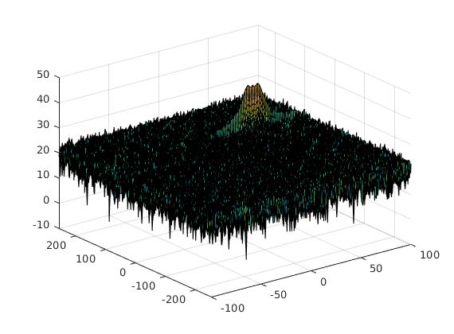
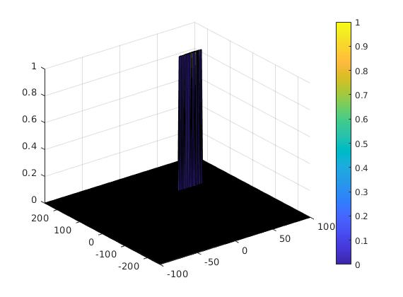

# Radar Target Generation and Detection
In this project, we will use Matlab to generate radar signal and utilize the signal to complete detection task.


### Project Pipeline


### Radar System Requirements


### CFAR Implementation

**1. Implementation steps for the 2D CFAR process**

After obatining our 2D-FFT data as follow:<br>



I design to set up a silding window to implement the CFAR method, I will let this window slide through the 2D-FFT matrix, and generate corresponding noise level for the cell under test (CUT). 

``` Matlab
window = ones(2*Tr+2*Gr+1,2*Td+2*Gd+1);
window(Tr+1:Tr+2*Gr+1,Td+1:Td+2*Gd+1) = 0;
window = window/((2*Tr+2*Gr+1)*(2*Td+2*Gd+1) - (2*Gr+1)*(2*Gd+1));
```


while silding, the center point of this window should overlap the current CUT point of the 2D-FFT matrix (RDM), and thus we can get the dot product of this window and the corresponding region in the 2D-FFT matrix. We sum up every elements in the resulting matrix, then we can get the noise level on the CUT. For a better result, we should add a offset value to this noise level. If the CUT value is under the noise level, we will see the CUT value as noise and cut it off.

**2. Selection of Training, Guard cells and offset**

| Tr  | Td  | Gr  | Gd  | Offset |
| --- | --- | --- | --- | ------ |
| 10  | 8   | 4   | 4   | 1.5    |

Tr: Traing cells along range dimension<br>
Td: Traing cells along doppler frequency dimension<br>
Gr: Guarding cells along range dimension<br>
Gd: Guarding cells along doppler frequency dimension<br>

**3. Steps taken to suppress the non-thresholded cells at the edges**

After we get the noise level matrix using our siling window as dicussed above. We can make a mask by padding the noise level matrix as follow:

``` Matlab
noise_level = padarray(noise_level,[Tr+Gr,Td+Gd],1e5,'both');
CFAR = 1*(RDM>noise_level);
```

The 1e5 value in the code block is supposed to be bigger than evevy decibels in the range doppler map (RDM). Thus we can make a mask by using '**RDM>noise_level**'. The edges of this mask are all 0 which can suppress the non-thresholded cells at the edges of the RDM.

Final output is as follow:


